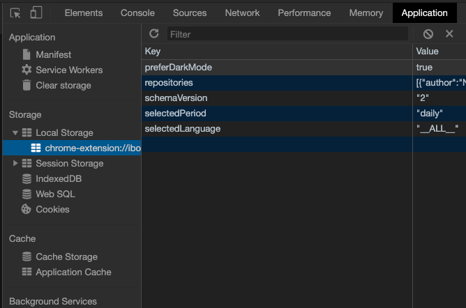

# よかった点
> javascriptの記述とHTMLの記述が頭の中でゴチャゴチャになった
- お疲れ様でした！情報がたくさんありすぎて最初は頭の整理はできないでしょう。とりあえず、写経でもいいので、手を動かしてみるのが大事ですね。

# さらによくするために
- セミコロンがつけてあったり、なかったりしてますね。モダンなjavascript実はセミコロンあってもなくても文法としてあっています。ただ、コードの可読性を高めるために、どっちらかに統一した方がいいです。

- インデントの揃え方は非常に気になります。インデントをちゃんと揃えた方がコードが見安くなり、文法ミスを起こしにくくなり、デバッグもしやすいと、いろんな利点があります。習慣的には下記のように揃えます。
```html
<div>
    <ul>
        <li>element1</li>
        <li>element2</li>
        <li>element3</li>
    </ul>
</div>
```

```js
function example () {
  console.log("example");
  for(var i = 0; i < 10; i ++){
    if (i < 5) {
      console.log("less then 5");
    } else {
      console.log("greater then 5");
    }
  }
}
```
詳細はこの[記事](https://webliker.info/35722/)を参考にしていただければと思います。

# その他のアドバイス
> 複数の結果をローカルストレージに保存できず、分からなかった
- コードの中身を確認して、気づいた問題点点をお伝えしますと、おそらく、keyとvalueの順序が逆になっているのではないかと思います。なので、keyが毎回からの文字列になって、そして毎回上書きされます。localStorageをデバッグするときに、chromeの検証ツールを活用すれば、どこがミスっているのか、探しやすくなります。具体的には下記の図示した通りにあります。



そして、localstorageの文法について、授業で配った教材もしくは[この記事](https://qiita.com/masamitsu-konya/items/c69515604570150d3ab9)を参考にして下さい。

