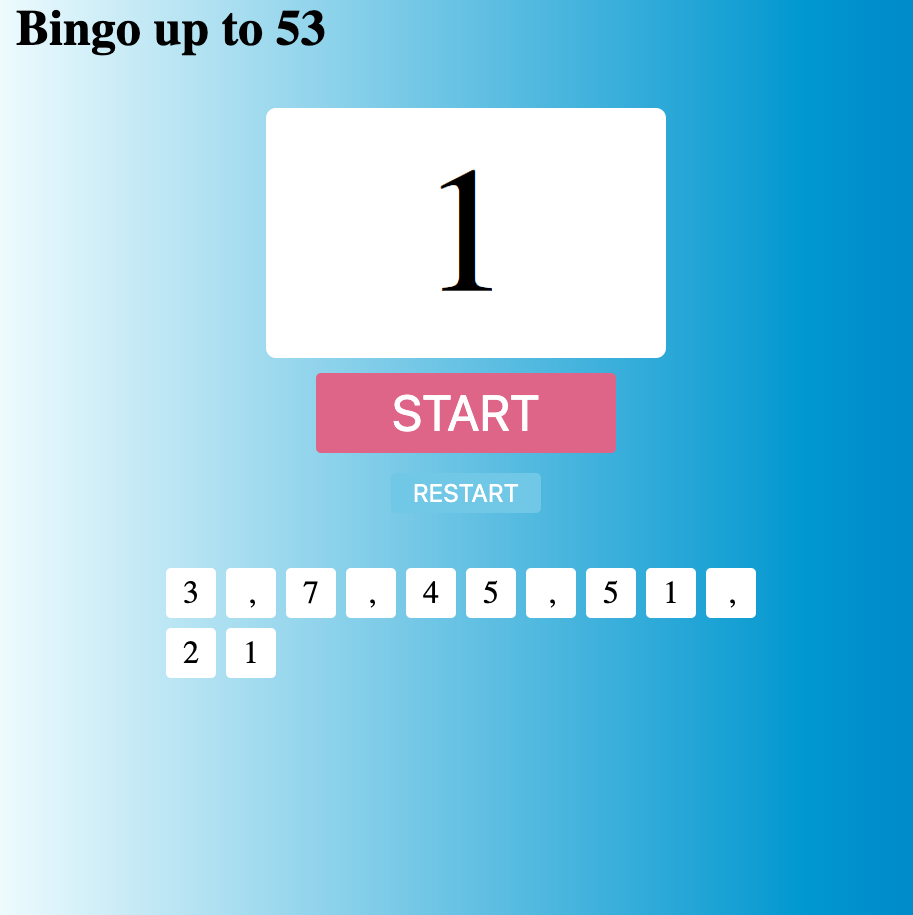

# よかった点
- 提出お疲れ様です。localStorageの書き方理解されたようですね。よかったです。
- bingoはなかなかいいアイディアですね。これがあれば、忘年会のビンゴ大会も盛り上がりそうですね！
- randomにソートするロジックはそのように実装できるのは初めて知りました！なるほどとなりました。こちらが勉強になりました！

# さらによくするために
> うまくできませんでした
- ちょっとしたバグがありましたね。ビンゴの途中で画面をrefreshすると下の図のようん現象が起きます。

</img>

このバグを起こすロジックは下記のコードににあるかと考えられます。
```js
else{
  // 前回のビンゴの番号の配列を読み込み
  nums = a;
  for (let times=0; times<localStorage.length-1; times++){
    var i = nums[times];
    $('#num').text(i);
    $('#num2').append('<div>' + i + '</div>');
  }
}
```
aはlocalStorageから取ってきた値です。つまりaは文字列になっています。javascriptの仕様で、文字列はcharacterの配列としてみられますので、この文字列に対してforループを回すと、一つずつ取り出すことになります。なので、どうすれば治るかと言いますと、まず、カンマがあるところを目印に、文字列を分けばいいです。javascriptの中で、`split()`という関数が用意されいます。これ使えば、一発で上記のロジックを実装できます。

> リロードした際に、前回の続きから実行できるようにしたかったが、数字の表示が初回と同じにならなかったです。
- localStorageに初期化のビンゴ配列と歴史データを両方保持すれば、実装できるはずです！ヒントとして、historyをキーにしたlocalStorageに初期化の配列のように、カンマ区切りで、数字が出されたたびに、そのlocalStorageの値をアップデートしていけばいいです。是非また考えてみて下さい。

# その他のアドバイス
- インデントをちゃんと揃えましょう！インデントをちゃんと揃えた方がコードが見安くなり、文法ミスを起こしにくくなり、デバッグもしやすいと、いろんな利点があります。習慣的には下記のように揃えます。
```html
<div>
    <ul>
        <li>element1</li>
        <li>element2</li>
        <li>element3</li>
    </ul>
</div>
```

```js
function example () {
  console.log("example");
  for(var i = 0; i < 10; i ++){
    if (i < 5) {
      console.log("less then 5");
    } else {
      console.log("greater then 5");
    }
  }
}
```
詳細はこの[記事](https://webliker.info/35722/)を参考にしていただければと思います。

